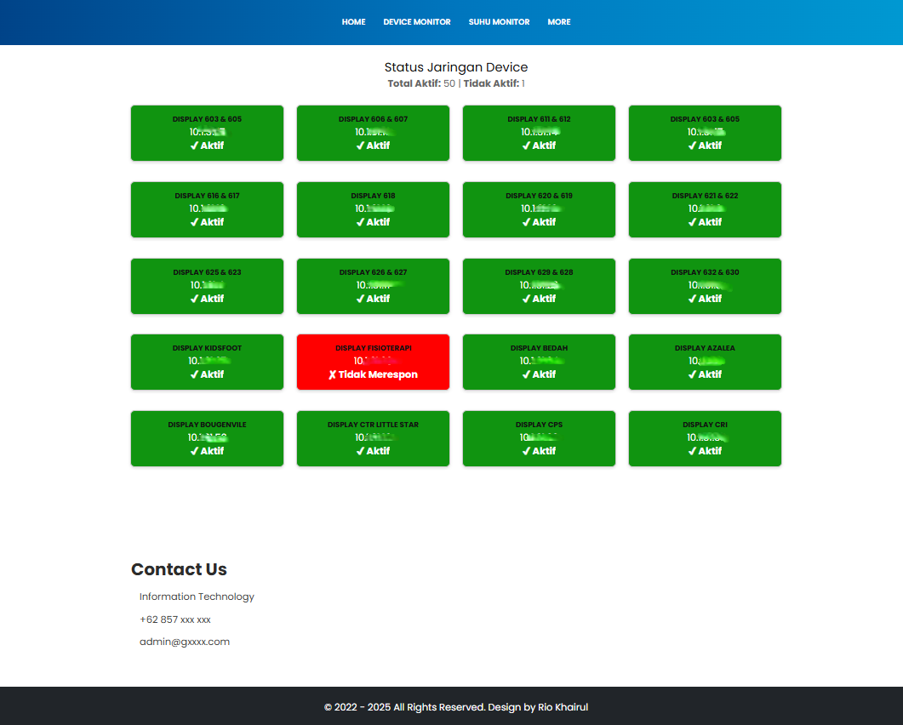

# Network Device Monitor - Real-time IoT Device Status Dashboard

A Laravel-based web application for monitoring the status of network devices through ICMP ping checks. This system provides real-time monitoring of display devices and network equipment with a user-friendly web interface.

## Features

-   **Real-time Device Monitoring**: Automatically pings devices to check their online status
-   **Interactive Dashboard**: Web-based interface showing device status with color-coded indicators
-   **Slideshow Display**: Automatically cycles through device groups for easy monitoring
-   **Statistics**: Shows total active and inactive devices count
-   **Responsive Design**: Works on desktop and mobile devices

## Screenshot



## Technology Stack

-   **Backend**: Laravel PHP Framework
-   **Frontend**: Bootstrap 5, JavaScript (ES6+)
-   **Network**: ICMP ping for device status checking
-   **Styling**: Custom CSS with Bootstrap integration

## Installation

1. **Clone the repository**

    ```bash
    git clone [repository-url]
    cd device-monitoring
    ```

2. **Install dependencies**

    ```bash
    composer install
    npm install
    ```

3. **Environment setup**

    ```bash
    cp .env.example .env
    php artisan key:generate
    ```

4. **Configure database** (if needed)
   Edit `.env` file with your database credentials

5. **Run migrations** (if using database features)

    ```bash
    php artisan migrate
    ```

6. **Start development server**
    ```bash
    php artisan serve
    ```

## Usage

### Accessing the Monitoring Interface

1. Navigate to the application URL (default: http://localhost:8000)
2. Click on "MORE" in the navigation menu
3. Select "IOT MONITORING" from the dropdown

### Device Configuration

Devices are configured in `app/Http/Controllers/DeviceStatusController.php` in the `$devices` array. Each device should have:

-   `name`: Display name for the device
-   `ip`: IP address to ping

Example:

```php
$devices = [
    ['name' => 'DISPLAY 100 & 101', 'ip' => '10.1.31.43'],
    ['name' => 'DISPLAY 105 & 106', 'ip' => '10.1.31.44'],
    // ... more devices
];
```

### API Endpoint

The system provides a JSON API endpoint:

-   **GET** `/device-status` - Returns device status information in JSON format

Response format:

```json
{
    "devices": [
        {
            "name": "DISPLAY 100 & 101",
            "ip": "10.1.31.43",
            "status": "UP"
        }
    ],
    "totalUp": 45,
    "totalDown": 2
}
```

## Project Structure

```
device-monitoring/
├── app/
│   └── Http/
│       └── Controllers/
│           └── DeviceStatusController.php  # Main controller for device monitoring
├── resources/
│   └── views/
│       ├── iot.blade.php                   # Main IOT monitoring page
│       ├── components/
│       │   └── iot-card.blade.php          # Device status card component
│       └── layouts/
│           └── app.blade.php               # Main layout template
├── public/
│   └── assets/
│       └── css/
│           └── style.css                   # Custom styles
└── routes/
    └── web.php                             # Route definitions
```

## Customization

### Styling

-   Modify `public/assets/css/style.css` for custom styles (recently optimized to remove unused CSS)
-   The main layout uses Bootstrap 5 classes for responsive design

### Device Display

-   Edit `resources/views/components/iot-card.blade.php` to change how devices are displayed
-   Adjust the number of devices per slide by modifying the `chunkArray(data.devices, 20)` call

### Monitoring Frequency

-   Change the monitoring interval by modifying the `setInterval(fetchStatus, 10000)` value in the JavaScript

### Recent Optimizations

-   **CSS Cleanup**: Removed unused CSS styles to improve performance
-   **File Structure**: Deleted unused CSS files (`bootstrap.css`, `bootstrap.min.css`, `font-awesome.min.css`, `icomoon.css`, `owl.carousel.min.css`, `responsive.css`)
-   **Code Refactoring**: Simplified the device status display component

## Security Considerations

-   The application uses ICMP ping which may require appropriate network permissions
-   Ensure proper firewall rules for the web server
-   Consider implementing authentication for production use

## Performance Optimizations

-   **Minified CSS**: Only essential styles are included in the optimized `style.css`
-   **Reduced File Size**: Removed ~90% of unused CSS code
-   **Faster Loading**: Improved page load times by eliminating unnecessary styles
-   **Clean Codebase**: Maintainable and focused CSS structure

## Browser Support

-   Chrome (recommended)
-   Firefox
-   Safari
-   Edge

## Contributing

1. Fork the project
2. Create your feature branch (`git checkout -b feature/AmazingFeature`)
3. Commit your changes (`git commit -m 'Add some AmazingFeature'`)
4. Push to the branch (`git push origin feature/AmazingFeature`)
5. Open a Pull Request

## License

This project is licensed under the MIT License - see the [LICENSE](LICENSE) file for details.

## Support

For support and questions, please contact the IT department.
